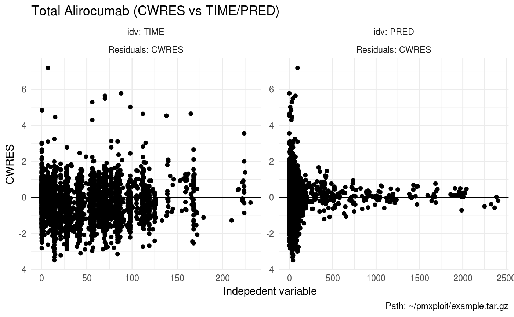

<!-- README.md is generated from README.Rmd. Please edit that file -->
pmxploit 
================================================================================================

The goal of **pmxploit** is to facilitate the post-processing analysis of non-linear mixed effects models developed with NONMEM.

It provides helper functions for visualizing and summarizing population analyses results, detecting outliers, computing numerical quality criteria and comparing multiple run results.

Requirements
------------

**pmxploit** can read runs executed with NONMEM 7.2 and higher (with results data contained in an xml file).

Installation
------------

``` r
# Install the latest version from GitHub
# install.packages('devtools')
devtools::install_github('pnolain/pmxploit')
```

Getting started
---------------

``` r
library(pmxploit)

# load a NONMEM run from its location
run <- load_nm_run("~/pmxploit/example")

# or from an archive file
# run <- load_nm_run("~/pmxploit/example.tar.gz")
```

### Diagnostic plots

``` r
plot_dv_vs_predictions(run, compartment = 2L, predictions = c("PRED", "IPRED"),
                       x_scale = "log", y_scale = "log")
```


``` r
plot_residuals(run, compartment = 2L, residuals = "CWRES", idv = c("TIME", "PRED"))
```



``` r
run %>%
  group_by(CMT) %>%
  plot_residuals(compartment = c(2L, 3L), residuals = "CWRES", idv = c("TIME", "PRED"))
```


### Parameters

``` r
plot_convergence(run, parameters = "theta")
```


``` r
run %>% 
  summarize_thetas()
#> # A tibble: 13 x 7
#>    id      name  estimate       se      rse  ci_low   ci_up
#>    <chr>   <chr>    <dbl>    <dbl>    <dbl>   <dbl>   <dbl>
#>  1 THETA1  TVCL    0.172   0.0152   0.0884   0.141   0.202 
#>  2 THETA2  TKON  559      NA       NA       NA      NA     
#>  3 THETA3  TKIN    0.124   0.00222  0.0180   0.119   0.128 
#>  4 THETA4  TKDE    1.35    0.0375   0.0279   1.27    1.42  
#>  5 THETA5  TVQ     0.500   0.0286   0.0571   0.443   0.558 
#>  6 THETA6  TVV1    3.23    0.204    0.0632   2.82    3.63  
#>  7 THETA7  TVV2    2.61   NA       NA       NA      NA     
#>  8 THETA8  TVKA    0.638   0.0468   0.0733   0.544   0.731 
#>  9 THETA9  TVF     0.590   0.0239   0.0406   0.542   0.638 
#> 10 THETA10 TVEP    0.275   0.00151  0.00548  0.272   0.278 
#> 11 THETA11 TVEA    0.582   0.0224   0.0385   0.537   0.627 
#> 12 THETA12 TVLAG   0.0298  0.00110  0.0369   0.0276  0.0320
#> 13 THETA13 COV1    1.56    0.0851   0.0544   1.39    1.73
```

``` r
run %>% 
  summarize_omega()
#> # A tibble: 7 x 8
#>   eta1  eta2  estimate      se    rse ci_low  ci_up    cv
#>   <chr> <chr>    <dbl>   <dbl>  <dbl>  <dbl>  <dbl> <dbl>
#> 1 ETCL  ETCL    0.279  0.0761  0.273  0.130  0.428  0.568
#> 2 EKIN  EKIN    0.0581 0.00462 0.0796 0.0490 0.0672 0.245
#> 3 EKDE  EKDE    0.171  0.0164  0.0963 0.138  0.203  0.431
#> 4 ETQ   ETQ     0.0691 0.0298  0.431  0.0108 0.127  0.267
#> 5 ETV1  ETV1    0.0990 0.0166  0.167  0.0665 0.132  0.323
#> 6 ETKA  ETKA    0.464  0.0495  0.107  0.367  0.561  0.769
#> 7 ETF   ETF     0.290  0.0717  0.248  0.149  0.430  0.580
```

``` r
run %>% 
  summarize_shrinkage(type = "ETA")
#> # A tibble: 9 x 3
#>   type  parameter shrinkage
#>   <chr> <chr>         <dbl>
#> 1 ETA   ETCL          0.626
#> 2 ETA   EKON          1    
#> 3 ETA   EKIN          0.204
#> 4 ETA   EKDE          0.265
#> 5 ETA   ETQ           0.755
#> 6 ETA   ETV1          0.327
#> 7 ETA   ETV2          1    
#> 8 ETA   ETKA          0.477
#> 9 ETA   ETF           0.438
```
